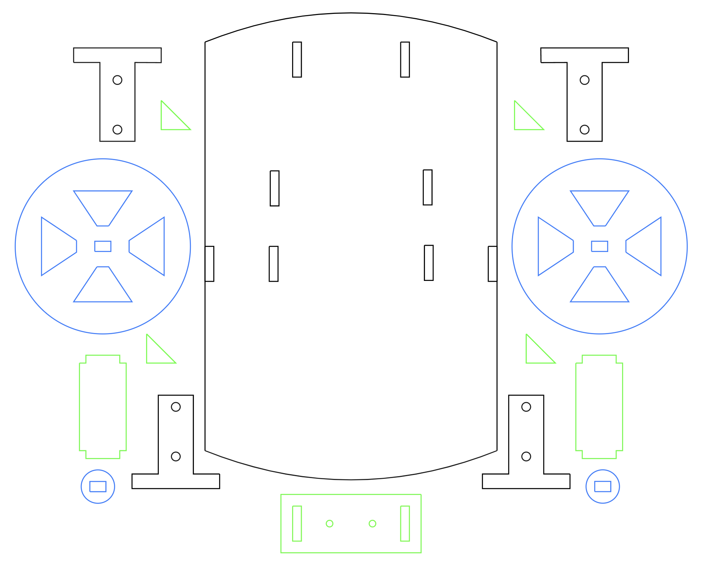

[LPCMakerClass](https://jdsalmonson.github.io/LPCMakerClass/) is the web page for a class I created and taught with Andrew Lozano in Spring 2016 at [Las Positas College](http://www.laspositascollege.edu) as part of the community education offerings.  The course was a whirlwind tour bootstrapping from basic electromagnetics to motors to electronic controllers to robots.  The students each fabricated and built and programmed an Arduino robot.  Course tuition included the purchase of an electronics starter kit with components necessary for building the projects covered in the course, including an Arduino controlled robot ([design and fritzing files here](https://github.com/jdsalmonson/LPCMakerClass/tree/master/Robot1)). The robot could run in several variations including phototropic mode; seeking light sensed by photo-resistors, or controlled by joystick.  Tuition also included an introductory three month student membership to the [Robot Garden](https://www.robotgarden.org/) maker space, including access to its facilities including laser cutter and 3D printers.  

<table>
  <tr>
    <th> LPC Maker arduino bot </th>
    <th> rear view with joystick </th>
  </tr>
  <tr>
    <td style="text-align:center">
      
      <figcaption>Note rubber bands around wheels for friction</figcaption>
    </td>
    <td style="text-align:center">
      
    </td>
  </tr>
</table>

[Laser Cutter CAD template](https://github.com/jdsalmonson/LPCMakerClass/blob/master/Robot1/Robot1c_flattened.svg)

[wiring diagram of photo-resistors driving wheel motor via H-bridge](https://github.com/jdsalmonson/LPCMakerClass/blob/master/Robot1/Robot1_H-Bridge_PhotoResistorWiring_9Volt.png)

