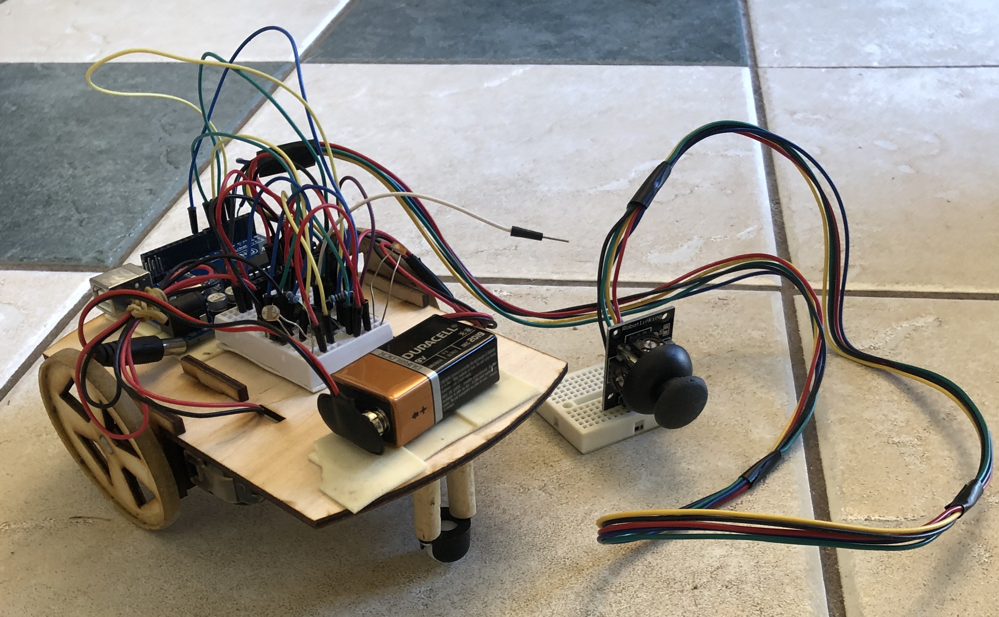
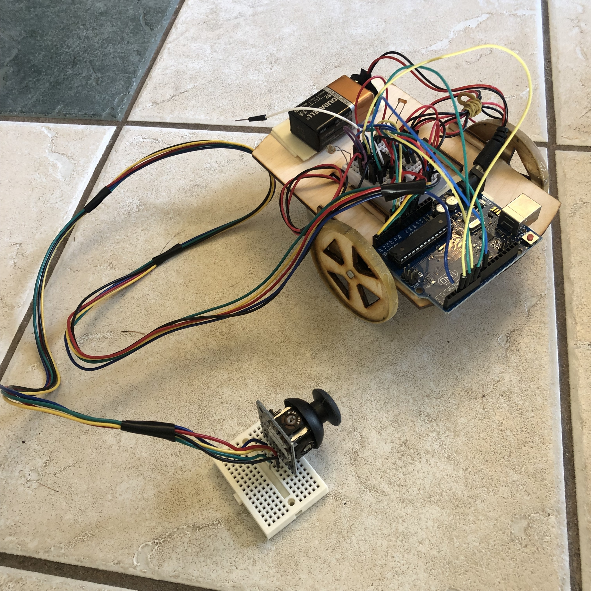

[LPCMakerClass](https://jdsalmonson.github.io/LPCMakerClass/) is the web page for a class I created and taught with Andrew Lozano in Spring 2016 at [Las Positas College](http://www.laspositascollege.edu) as part of the community education offerings.  The course was a whirlwind tour bootstrapping from basic electromagnetics to motors to electronic controllers to robots.  The students each fabricated and built and programmed an Arduino robot.

[Link to robot design and fritzing files](https://github.com/jdsalmonson/LPCMakerClass/tree/master/Robot1)

LPC Maker arduino bot      |  rear view
:-------------------------:|:-------------------------:
 | 

