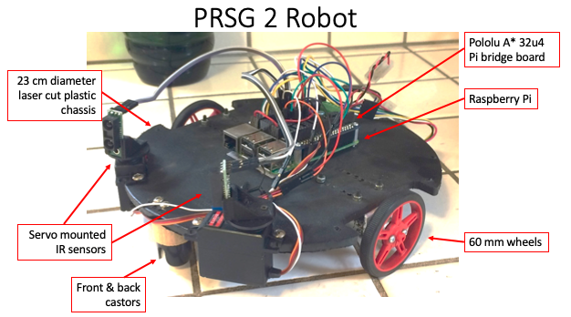

From 2016 to 2018 I was an active participant of the [Programming Robots Study Group](https://programmingrobotsstudygroup.github.io/) through the [Robot Garden](https://www.robotgarden.org/) Maker-space.  Our charter was to learn about [ROS](https://ros.org/) and build robots that utilize it.  We built two robots: the PRSG1 and PRSG2 shown above.  Both were battery operated Raspberry Pi computers with an Arduino "hat" that interfaced with the sensors, motors, and encoders.

My [PRSG fork](https://github.com/jdsalmonson/prsg2_robot)

My [quadrille ROS node](https://github.com/jdsalmonson/quadrille/blob/master/src/quadrille.py) using the ROS Twist message.
