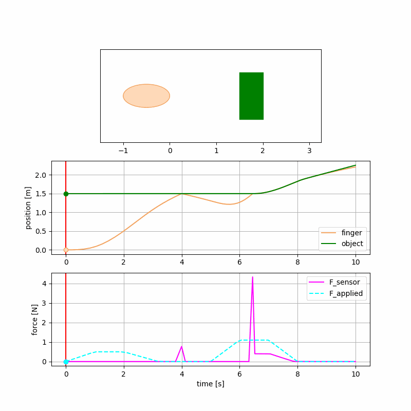

> Figure 1: The 1D robot (i.e. a finger) accelerates in response to an initial applied force, then coasts until bouncing off the wall.  The force sensor on the finger tip records the touch interaction with the wall.  The robot then re-accelerates with sufficient force to overcome the static friction of the object and thus push it.  Finally, the robot's applied force turns off and since the robot has a larger drag force, it decelerates and falls behind the object.

[OneD Robot](https://github.com/jdsalmonson/py_1d_robot_arm) is a simulation of a 1D robot.  It is comprised of only a finger that moves back and forth according to an applied force.  The finger tip interacts with an object; touching, pushing or bouncing off of it.  A force sensor on the finger tip records the touch interaction with the object.  As such this is one of the simplest robot simulations of which one can conceive.


<div id="iframeDiv">
  <iframe width="850" height="950"
          src="../images/oneD_robot/oneD_robot.html"></iframe>
</div>

> Figure 2: The 1D robot accelerates under and applied force until it hits the object.  Since it applied force is insufficient to overcome the object's static friction, neither the robot or object move.  The robot then applies a larger force, sufficient to break the object's static friction, and thus both begin to accelerate.  The robot then ceases to apply a force and so, having a larger drag force than the object, decelerates and falls behind the object.

There are several good tools available for simulating robots interacting with their environment in 3D, including open source products MuJoCo, PyBullet, and Gazebo.  These all incorporate non-trivial contact detection algorithms and force sensing.  However, to investigate how an AI agent understands and interacts with its environment; i.e. how it maintains a sense of state, it is useful to consider the simplest possible environments.  Here we model a 1D robot interactions with an object; essentially a fingertip that moves back-and-forth in response to an applied force, while also being subject to a drag force.  The finger robot can then interact with an object of some mass and static and kinetic friction; pressing or pushing on it or bouncing off it.  The finger perceives these interactions with the object through a force sensor at its tip.  Such a robot and environment model is simple enough to be constructed from scratch, which enables one to understand, hack or extend the model as necessary.  

The simulation is broken into a sequence of epochs, defined by whether the finger and object are separated or touching in compression or tension.  It was convenient to use the SciPy initial-value ODE solver, `solve_ivp`, to solve the equations of motion.  I've written my share of Runge-Kutta solvers and so am happy to use this canned solver, which works very well.  In particular, `solve_ivp` allows the definition of events; conditions on which to terminate the integration.  We define events where the robot and object touch each other and also where the merged robot and object pass from compression to tension (thus imminently separating), thus re-setting the equations of motion for the next solver epoch.

Force equations are 2nd order in position, $$x$$.  That is the force $$F = m a = m \ddot{x}$$, is proportional to the second time deriviative of position.  This is Newton's 2nd Law of Motion.  So to solve for the change in position, $$x$$, of an object, subject to a force, $$F$$, using an ODE solver such as `solve_ivp`, it needs to be broken up into two 1st order differential equations: $$\dot{x} = v$$, and $$\dot{v} = a = F/m$$, for the rate of change of position and velocity, respectively.  In the present case we want to solve for the position of the robot finger, $$x_f$$, and object, $$x_o$$, but we also need to know either the individual evolution of the velocity of the robot finger, $$v_f$$, and the object, $$v_o$$, or their combined velocity when they are stuck together, $$v_{fo}$$.  To standardize the solve, we integrate all five ODE's for $$x_f$$, $$x_o$$, $$v_f$$, $$v_o$$, and $$v_{fo}$$, and use the appropriate velocities depending on if the finger and object are merged or not:

$$
\begin{align}
  \dot{x_f} &= v_f \text{ or } v_{fo}\\
  \dot{x_o} &= v_o \text{ or } v_{fo}\\
  \dot{v_f} &= \frac{F_i}{m_f} \\
  \dot{v_o} &= - \frac{F_f}{m_o} \\
  \dot{v_{fo}} &= \frac{(F_i - F_f)}{(m_{f} + m_{o})}
\end{align}
$$

where the incident force is the applied minus drag force, $$ F_i \equiv F_a - F_d $$ and $$F_f$$ if the (static or kinetic) friction force on the object.  The right-hand side of the first two equations is determined by whether the finger and object are separate or touching.

The key parameter to set is the applied force function, `F_a(t)`.  For instance, one can specify a series of (time, force) pairs and create an interpolation using scipy, for example:
```
from scipy.interpolate import interp1d
from oneD_finger import OneDFinger

def F_a(self, t):
    """specify an applied force profile"""
    f_a = interp1d([0.0, 1.0, 2.0, 3.0], [0., 0.5, 0.5, 0.])(t)

    return f_a

OneDFinger.F_a = F_a
```
At present the entire applied force history is specified before the simulation is integrated.  It is a future task to allow an agent to dynamically update the applied force during the simulation.

### Force sensor for sensing touch interactions

The robot's sense of touch is modeled as a force sensor at the tip of the finger.  This force is only non-zero and positive when the finger is in contact with the object.  It is made up of a constant component resulting from the robot pushing on the object, and an impulsive component resulting from the robot balistically bouncing off the object.  The constant component of this force is simply the compression force between the finger and object.  The robot's total force is its applied force minus its drag force, $$F_{applied} - F_{drag}$$.  When its total force is below the threshold of the object's static friction, $$F_{static}$$, no motion results, but the robot's force sensor reads the compression force of the robot pressing on the immovable object.  When the robot's total force is above the threshold of the object's $$F_{static}$$, the object begins to move, but resists with a kinetic friction force $$F_{kinetic}$$, and the force sensor feels the "weight" of objects kinetic friction pushing back onto the finger.  The robot's force sensor is thus given by:

$$
\begin{align}
  F_{constant} &= F_{applied} - F_{drag} \qquad \text{if    } F_{applied} - F_{drag} < F_{static} \\
  &= F_{kinetic} \qquad \qquad \qquad \text{if    } F_{applied} - F_{drag} > F_{static} \text{ or } v_{object}  <> 0.0 \\
\end{align}
$$

This sensor will also sense transient forces when the robot and object bounce off each other.  This is modeled as the change of the center-of-momentum change in the momentum:

$$
  F_{impulse} = M_{finger} (v_{finger} - v_{CM}) * (1 + K_{elastic}) / \Delta t
$$

where $$K_{elastic}$$ is a coefficient of restitution ( = 1 for elastic collisions, = 0 for inelastic collisions), $$v_{CM}$$ is the center-of-momentum velocity, and $$\Delta t$$ is the numerical time step.  The force sensor is then the sum of the compression force and the impulse force.  The size of $$\Delta t$$ isn't a precise measure and will typicallly be longer than the physical timescale for a solid objects bouncing off eachother, but it serves as a convenient lower bound to model the objects as soft.