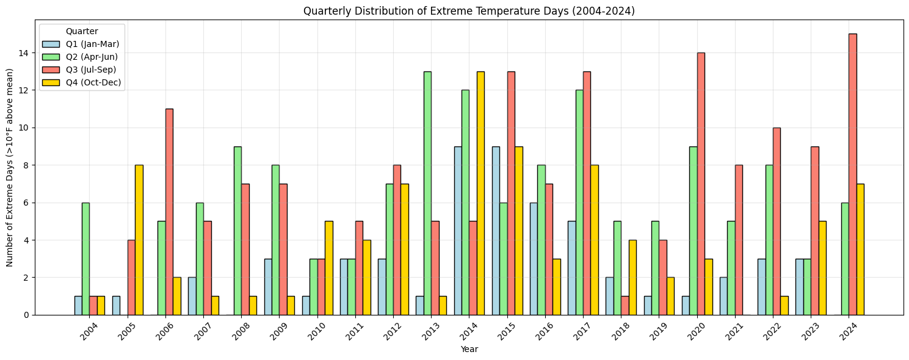

<!-- # Summer Bummer: Quantifying the Hot Summer of 2024 in Livermore, CA. -->

| Quarterly warm evenings count in Livermore compared to ocean surface temperature over 20 years.|
|:--:|
|  |
| *Number of evenings per seasonal quarter exceeding the mean on that date by more than 10°F.  The summer quarter (Jul-Sep) of 2024 had the most exceptionally warm evenings, specifically 15, of any quarter of the last 20 years, including the multi-year drought of 2014-2017.  Also, exceptional ocean surface temperatures off the coast of California generally correlate with frequency of warm evenings.* |

## Abstract

*In Livermore, CA the summer of 2024, specifically the quarter from July through September, had more excessively warm evenings than any quarter over the last 20 years.  These warm evenings, defined as having a temperature at 9 o'clock in the evening that is 10° Fahrenheit above the mean temperature at 9 PM on that date, are typically indicative of high pressure that keeps the cooling ocean breezes at bay.  While such occasional warm, high pressure evenings have always been a feature of Livermore weather, it appears that such evenings are more common over the last decade (2014 - 2024) than the decade prior (2004 - 2014).  Furthermore, the frequency of these warm evenings correlates with the surface temperature of the Pacific Ocean off the San Francisco coast.*

---

## Air Temperature

It sure seemed like a hot summer this year, 2024.  Although relatively few high temperature records were broken in my famously hot town of Livermore, California, there seemed to be a surplus of hot days that stayed hot into the evening and through the night, barely cooling to room temperature by morning before being baked again by the rising sun.  This forced my household to run our air conditioning through the night more than we wanted and also forced me to reschedule my runs from the afternoon, when I've been accustomed to a pleasant turn down in the temprature, to the morning hours in order to beat the heat.  Upon relating my alarm about this anomalously warm season to a couple kronies, I was surprised that they didn't share my same impression and didn't think this summer particularly stood out.  Had I imagined it?  Am I getting soft in my middle age -- no longer able to endure the Livermore summers I've experienced for nearly 30 years?  Or do my friends just need to get out more?  I decided that I needed to crunch some numbers to find out.  My [github repository](https://github.com/jdsalmonson/LVK_Temperature_Analysis) contains the data and Python notebooks for the analysis and plots presented herein.

Livermore is known for its blistering hot summer days with temperatures often in triple digits.  However, we also benefit from being located 40 miles inland from the Pacific Ocean from which a cooling westerly breeze will often arise in the afternoon, drawing in a cool marine layer of moist air that can drop the temperature from tank-top to jacket weather within a couple of hours.  A cool evening makes for a pleasantly cool night and morning before the next day's sun drives up the mercury again.  This cycle of hot days and cool nights has always been interspersed by the occasional warm evening, where high pressure prevents the cool marine layer from flowing inland, keeping our town enveloped in the warm, continental air mass.  Such warm evenings can make it difficult to sleep, but have historically been relatively rare, so air conditioning wasn't seen as a necessity.

These warm, high pressure evenings have become noticeably more common in Livermore over the years.  For nearly 30 years I would bike home from work in the afternoons, westward across town.  In the early days of this routine I would ride in a tucked position against a stout, sometimes brisk headwind of the incoming marine layer.  Over the course of that quarter century, a growing proportion of those rides have been gradually replaced by calmer, warmer (sometimes hot) rides home.  

I wanted to quantify the frequency of warm evenings in Livermore over the last 20 years.  These are evenings distinguished by warm, stagnant air, due to high-pressure, that don't cool off appreciably at sunset and can stay uncomfortably warm (in the absence of air conditioning) throughout the night.  To do this, I downloaded hourly temperatures over the last 20 years from the Livermore Airport (LVK) from [NOAA](https://www.ncei.noaa.gov/access/search/data-search/local-climatological-data-v2?bbox=37.740,-121.823,37.612,-121.695&pageNum=2&dataTypes=HourlyDryBulbTemperature&dataTypes=HourlyWetBulbTemperature&dataTypes=MonthlyMaximumTemperature&dataTypes=MonthlyMeanTemperature&dataTypes=MonthlyMinimumTemperature&startDate=2024-01-01T00:00:00&endDate=2024-10-01T23:59:59).  I then used the daily air temperature at 9pm (past sunset) as a measure of these warm conditions.  I calculated a 5-day rolling mean and standard deviation of this daily temperature, averaged over 20 years, from 2004 to 2024.  I could then identify the days that significantly exceeded this mean.  I define these warm, high-pressure days as ones that exceed the mean on that date by 10° Fahrenheit, which is a significant departure at roughly twice the standard deviation.

<!--  HTML version of below.  Probably don't need it.

    
<strong>Daily mean temperature distribution at the Livermore Airport</strong>

    
    
<em>Daily mean temperature at 9 PM, taken over a 5 day rolling window, and its standard deviation. Note that the standard deviation is about ±5° F.</em>

-->

| Daily mean temperature distribution at the Livermore Airport |
|:---------------------------------------------------:|
|  |
| *Daily mean temperature at 9 PM, taken over a 5 day rolling window, and its standard deviation.  Note that the standard deviation is about ±5° F.* |

| Selected Epochs of Seasonal Evening (9 PM) Temperature Excursions Taken at the Livermore Airport over the Last 20 Years |
|:--:|
|  |
| *2021-2024: recent years, although not drought years, show numerous warm evening temperature excursions including a couple called out broken records.* |
|  |
| *2014-2017: a period of extended drought also had numerous warm evening temperature excursions.  (Note that 2016 had fewer excursions that the other years in this period and was more typical.)* |
|  |
| *2004-2006: for comparison, the first few years of the 20 history exhibit relatively few large temperature excursions (> 10°F above the mean) and the distribution of temperatures is well bracketed by the standard deviation about the mean.* |

I binned the number of excessively warm evenings by year.  This figure (below) immediately highlights the years 2014, 2015, and 2017 as banner years for number of warm evenings.  These years were part of a multi-year drought in California.  Further, I would argue that this figure suggests a general upward trend in the number of warm evenings over the last 20 years.  

I then wanted to look at a finer temporal resolution, so I binned the data into four quarters corresponding to the seasons: Winter (January - March), Spring (April - June), Summer (July - September), Autumn (October - December).  I did this both because I didn't have complete data for the entirety of 2024 and also in anticipation of comparing it with temporally finer grained ocean surface data.  This data shows that the summer of 2024 was the most extreme season of the last 20 years, with 15 extreme days over its three months.  The next most extreme summer was 2020, with 14 extreme days, followed by the summers of 2015 and 2017 (drought years) with 13 extreme days each.  One can certainly argue that exceeding the previous record by one does not make the summer of 2024 a statistical outlier.  However, it is noteworthy and perhaps alarming that an otherwise non-descript year with non-drought conditions and few, if any, record-breaking high temperatures would yield a new high-water-mark in number of exceptionally warm evenings.  

| Evening temperature histories at the Livermore Airport |
|:--:|
|  |
| *Annual number of days exceeding the seasonal mean by more than 10°F.  Note that the record for 2024 ends in October and so does not represent a complete year.* |
|  |
| *Number of days per quarter exceeding the seasonal mean by more than 10°F.  The key point is that the summer quarter (Jul-Sep) of 2024 had the most exceptionally warm evenings, specifically 15, of any quarter of the last 20 years, including the period of drought: 2014-2017.* |

## Ocean Temperature 

Ocean temperatures are known to have significant impact on the weather, so I downloaded 20 years of ocean surface temeperature from [buoy #46214](https://www.ndbc.noaa.gov/station_page.php?station=46214) bobbing off the coast of San Francisco at the edge of the continental shelf.  I followed a similar 5-day rolling mean window to calculate a smoothed daily mean seasonal ocean temperature profile.  In order to quantify how often the ocean temperature significantly deviates from the mean, I calculated the percentage of days per month that exceed the mean on that date by more than a standard deviation.  It is interesting to note the seasonal cycle in this data; summers have more days that exceed the mean than do winters.  This is subtle effect where the ocean temperatures tend to be more variable and scattered in the Summer and Fall than in the Winter.  This is roughly captured by the wiggles in the rolling mean temperature, but also the standard deviation in Winter is about ±1° C, but increases to ±1.5° C or so in the summer and fall.

One key take-away from this data is that there were extended periods of unusually warm ocean during the drought years of 2014, 2015, 2016, 2017, and persisting somewhat into 2018 and 2019.  The other interesting point to note is that the 2023/2024 Winter, preceding our most recent warm Summer, had a several month period of exceptionally warm waters.  While the warm Winter waters don't directly imply causation of a subsequent warm Summer, there does appear to be a by-eye corrolation of exceptionally warm ocean temperatures with those of the air.

| Ocean Buoy #46214 Temperature Log |
|:--:|
|  |
| *Daily mean ocean surface temperature, taken over a 5 day rolling window, and its standard deviation.*  |
|  |
| *The monthly percentage [%] of days that exceed the mean seasonal ocean temperature by one standard deviation (i.e. percent of days 1-sigma above the mean) for 20 years of temperature data taken from ocean buoy #46214 off the coast from San Francisco.*  | 

## Summary

Combining the seasonal, quarterly air temperature data at Livermore Airport with the ocean temperature data of buoy #46214 gives the plot 
shown at the top of this post.  By-eye, this plot seems to suggest a correlation between the frequency of occurence of exceptionally warm air and ocean temperatures.  To be more quantitative would require more data from more airports and buoys and would be well beyond the scope of this blog post.  Such effects have been studied in detail elsewhere.  But it is insightful to look back on a generation of data from one geographic location and see how things have changed.  Much like how an individual standing on the surface of the Earth can scarcely perceive its curvature, our local, myopic experience of climate change is barely able to discern its ponderous, inertial movement.

The point of this exercise is to quantify my perception that the summer of 2024 was particularly warm.  Indeed, this summer had the most extreme temperature days (15) of any season over the last 20 years (followed by 14 days in the summer of 2020 and 12 to 13 days each in various seasons of drought years 2013, 2014, 2015, 2017).  Out of curiosity, I also compared this to extrema in offshore ocean surface temperatures.  By eye, strong ocean temperature warming excursions during the aforementioned drought years as well as the 2023/2024 Winter months appear to correlate with the frequency of warm summer days in Livermore.  While this correlation is interesting and suggestive of a plausible link between offshore ocean and Livermore air temperatures, it isn't possible to draw hard conclusions from it.

Increased evening temperatures as a consequence of a warming climate, known as "night warming", has long been understood and predicted in the climate literature.  For instance in 2018 the California Office of Environmental Health Hazard Assessment noted that over the last 30 years
[extreme evening temperatures have increased three times faster than extreme daytime temperatures](https://oehha.ca.gov/epic/changes-climate/extreme-heat-events#:~:text=Both%20extreme%20heat%20days%20and%20nights%20increased%20at%20a%20faster%20rate%20over%20the%20last%2030%20years%20than%20the%20long%2Dterm%20trend%2C%20at%20a%20rate%20of%207%C2%A0and%2021%C2%A0days%20and%20nights%20per%20year%2C%20respectively.).  In general this effect is primarily attributed to the thermal blanketing of [increased cloud cover](https://blog.ucsusa.org/kristy-dahl/with-climate-change-nights-are-warming-faster-than-days-why/#:~:text=Why%20are%20nights%20warming%20faster%20than%20days%3F), which, in turn, is the result of warming-induced increased evaporation.  Interestingly, this explanation is not consistent with my observations here in Livermore.  Locally, my experience is that the warm temperatures are predominantly due to suppression of afternoon off-shore sea breezes rather than from increased cloud cover.  I would argue that living in a warm region near a cool ocean situates us so that small changes in the position of the marine air, as it sweeps back and forth over us, create an exaggerated effect on our local climate.

As always with data analysis, data is messy and statistics are superlative to damned lies.  The random fluxuations, interscale associations, correlations and anticorrelations are all embedded into the structure of an impartial data domain that can tell all stories at once.  Our job is to connect the coherent segments of an emerging trend while ignoring those that just happen to align with the narrative we are attempting to weave.  Reducing a limited dataset, such as the one presented here, of a complex phenomenon such as climate down to simple moments to be used as litmus tests for drawing direct conclusions is a fraught task.  The summary statement that the summer of 2024 in Livermore, CA was the most extreme of any in the last 20 years is of limited meaning without context.  Hopefully the trends exhibited in the plots shown here lend credence and back-story to this naked statistic.

## References

1. My github repo of Python notebooks & data for this analysis: [LVK_Temerature_Analysis](https://github.com/jdsalmonson/LVK_Temperature_Analysis)
2. NOAA National Center for Environmental Information: [Local Climatological Data](https://www.ncei.noaa.gov/access/search/data-search/local-climatological-data-v2)
3. NOAA National Data Buoy Center: [Buoy #46214](https://www.ndbc.noaa.gov/station_page.php?station=46214)
4. California OEHHA: [Extreme Heat Events](https://oehha.ca.gov/epic/changes-climate/extreme-heat-events)
5. Kristy Dahl blog post: [With Climate Change, Nights Are Warming Faster than Days. Why?](https://blog.ucsusa.org/kristy-dahl/with-climate-change-nights-are-warming-faster-than-days-why/)

*No AI was used in the writing of this blog text.*